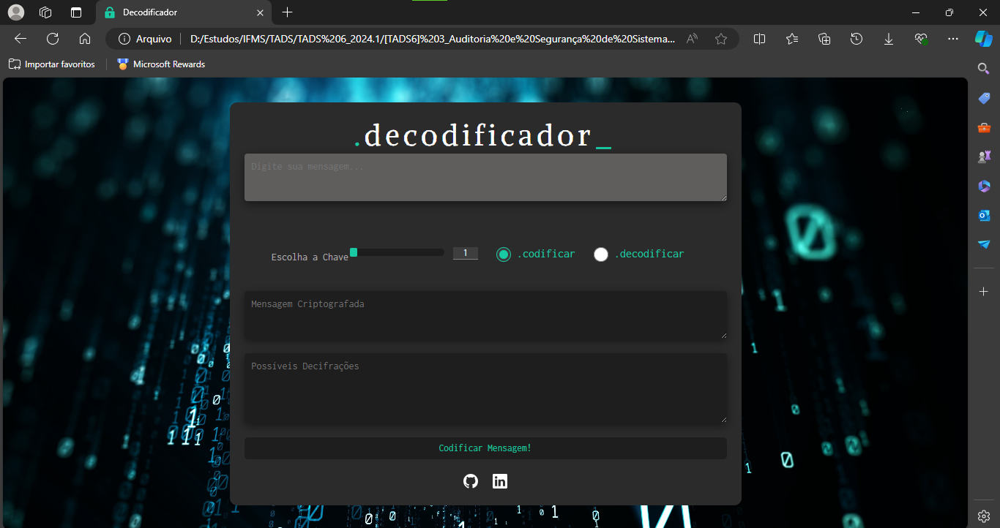

# Codificador/Decodificador 🔒

Este projeto implementa um **Codificador/Decodificador** de texto utilizando as técnicas de **Base64** e **Cifra de César**. A aplicação foi desenvolvida como parte da disciplina de **Auditoria e Segurança de Sistemas** do curso de **Tecnologia em Análise e Desenvolvimento de Sistemas** do **Instituto Federal de Mato Grosso do Sul (IFMS)**.

## Funcionalidades

- **Seleção de Método de Criptografia**: Escolha entre **Base64** e **Cifra de César**.
- **Opções de Codificação e Decodificação**: Aplique a codificação ou decodificação de texto com um simples clique.
- **Incremento Personalizado**: Defina o valor do incremento ao utilizar a **Cifra de César**.
- **Interação Simples e Intuitiva**: Interface amigável que facilita o uso das funções de criptografia.

## Tecnologias Utilizadas

- **HTML**: Estrutura do projeto.
- **CSS**: Estilização da interface.
- **JavaScript**: Implementação das funcionalidades de criptografia.

## Como Utilizar

1. **Baixe o código** deste repositório.
2. **Abra o arquivo `index.html`** no seu navegador.
3. **Escolha entre codificar ou decodificar** a mensagem.
4. **Digite sua mensagem** e clique no botão para visualizar o resultado.

Agora você está pronto para criptografar e descriptografar suas mensagens!

---

